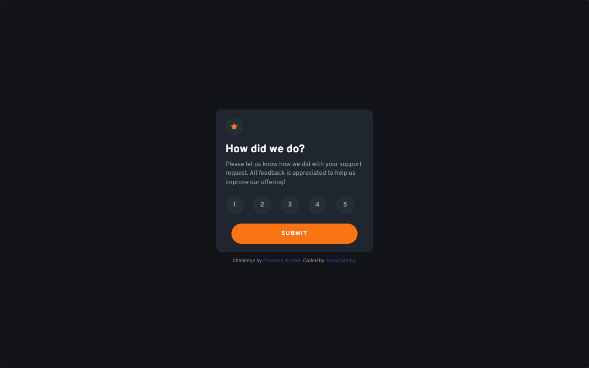
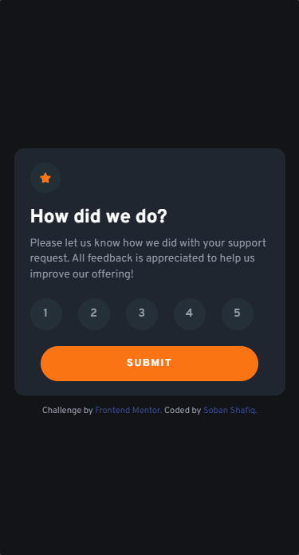

# **Frontend Mentor - Interactive rating component solution**

This is a solution to the [Interactive rating component challenge on Frontend Mentor](https://www.frontendmentor.io/challenges/interactive-rating-component-koxpeBUmI). Frontend Mentor challenges help you improve your coding skills by building realistic projects. 

## Table of contents

- [Overview](#overview)
  - [The challenge](#the-challenge)
  - [Screenshot](#screenshot---desktop)
  - [Links](#links)
- [My process](#my-process)
  - [Built with](#built-with)
  - [What I learned](#what-i-learned)
  - [Useful resources](#useful-resources)
- [Author](#author)

## **Overview**

### **The challenge:**

Users should be able to:

- View the optimal layout for the app depending on their device's screen size
- See hover states for all interactive elements on the page
- Select and submit a number rating
- See the "Thank you" card state after submitting a rating

### **Screenshot - Desktop:**


### **Screenshot - Mobile:**



### **Links:**
- Solution URL: [Add solution URL here](https://your-solution-url.com)
- Live Site on Netlify: [Interactive Rating Box](https://js-rating-box.netlify.app)

## **My process:**

 ### Built with:
  - Semantic HTML5 markup.
  - CSS custom properties.
  - Flexbox for Layout.
  - Mobile-first workflow for responsive webpage.
  - JavaScript DOM Manipulation.


### What I learned:

- Using Event Listeners in JavaScript.
- Performing DOM Manipulation when event is triggered.


```js
    btn.addEventListener("click", () => {
      // some code here
    });
```
```js
    btn.addEventListener("click", () => {
        thanksBox.classList.remove("hidden");
        box.classList.add("hidden");
    });
```

### Useful resources

- [MDN Web Docs](https://developer.mozilla.org/en-US/docs/Web/API/EventTarget/addEventListener) - Understanding the addEventListener method of JavaScript. Also helpful for learning other JS methods like adding/removing classes, changing HTML content, etc.

<br>
<hr>

## Author

- GitHub - [the-soban](https://github.com/the-soban)
- LinkedIn - [Soban Shafiq](https://www.linkedin.com/in/soban-shafiq-6085531a4/)
- Frontend Mentor - [@the-soban](https://www.frontendmentor.io/profile/the-soban)
- Twitter - [@the_soban3](https://twitter.com/the_soban3)
- Showwcase - [the_soban](https://www.showwcase.com/the-soban)

<hr>
