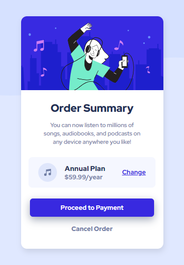

# **Frontend Mentor - Order summary card solution**

This is a solution to the [Order summary card challenge on Frontend Mentor](https://www.frontendmentor.io/challenges/order-summary-component-QlPmajDUj). Frontend Mentor challenges help you improve your coding skills by building realistic projects. 

## Table of contents

- [Overview](#overview)
  - [The challenge](#the-challenge)
  - [Screenshot](#screenshot---desktop)
  - [Links](#links)
- [My process](#my-process)
  - [Built with](#built-with)
  - [What I learned](#-what-i-learned)
- [Author](#author)


## **Overview**

### The challenge:

Users should be able to:

- View the webpage responsively on desktop and mobile
- See hover states for interactive elements

### **Screenshot - Desktop:**


### **Screenshot - Mobile:**



### Links

- Solution URL: [Add solution URL here](https://your-solution-url.com)
- Live Site URL: [Live Site on Netlify](https://your-live-site-url.com)

## **My process**

- Built with:
  - Semantic HTML5 markup for structure
  - CSS Flexbox properties for Layout
  - Mobile-first workflow for Responsiveness
  - GoogleFonts for Fonts

<br/> 

- What I learned:

  1. Active states in CSS with *:hover* pseudo-class.
  2. Centering content on webpage using *flex* on *body* element .


```css
.payment-btn{
    background-color: hsl(245, 75%, 52%);
    color: white;
    transition: all 0.2s;
}

.payment-btn:hover{
    background-color: hsl(245, 75%, 52%, 0.6);
}
```

```css
body{
    min-height: 100vh;
    display: flex;
    flex-direction: column;
    align-items: center;
    justify-content: center;
}
```
<br>
<hr>

## Author

- LinkedIn - [Soban Shafiq](https://www.linkedin.com/in/soban-shafiq-6085531a4/)
- GitHub - [the-soban](https://github.com/the-soban)
- Frontend Mentor - [@the-soban](https://www.frontendmentor.io/profile/the-soban)
- Twitter - [@the_soban3](https://twitter.com/the_soban3)
- Showwcase - [the_soban](https://www.showwcase.com/the-soban)

<hr>
