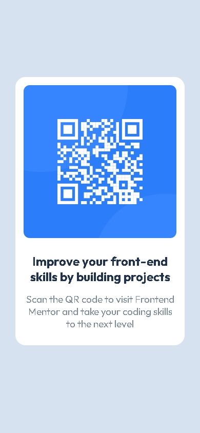

# **Frontend Mentor - QR code component solution**


Here's my solution for the [QR code component challenge on Frontend Mentor](https://www.frontendmentor.io/challenges/qr-code-component-iux_sIO_H). Frontend Mentor challenges are helping me improve my front-end skills by building interactive projects and chellenges. 

## Table of contents

- [Overview](#overview)
  - [Screenshot](#screenshot)
  - [Links](#links)
- [My process](#my-process)
  - [Built with](#built-with)
  - [What I learned](#what-i-learned)
  - [Continued development](#continued-development)
  - [Useful resources](#useful-resources)
- [Author](#author)
- [Acknowledgments](#acknowledgments)


## Overview

### Screenshot - Desktop:


### Screenshot - Mobile:




### Links:

- Solution URL: [Add solution URL here](https://your-solution-url.com)
- Live Site URL: [qr-code-component on Netlify](https://qr-code-componentfm.netlify.app)

## My process

### Built with:

- Semantic HTML5 markup for clean structure.
- Mobile-first workflow for Responsive Design.
- CSS custom properties, Flexbox for consistent layout.
- Github for Code Management.
- Netlify to host the Live Site.


### What I learned:

While working with HTML and Custom CSS Properties, I learned the Mobile-First approach for developing a responsive webpage.
To see how you can add code snippets, see below:

```css
@media only screen and (min-width: 1200px){
      html{
        font-size: 24px;
    }
}
```

### Useful resources:

- [TypeScale](https://typescale.com/) - This helped me for understanding font scales. It has a font scale calculator for converting px to em/rem. Highly recommend this for making consistent fonts.
- [W3Schools](https://www.w3schools.com/css/css3_mediaqueries.asp) - This documentation helped me understand CSS Media Queries.


## Author

- LinkedIn - [Soban Shafiq](https://www.linkedin.com/in/soban-shafiq-6085531a4/)
- Frontend Mentor - [@the-soban](https://www.frontendmentor.io/profile/the-soban)
- Twitter - [@the_soban3](https://www.twitter.com/the_soban3)


## Acknowledgments

This is where you can give a hat tip to anyone who helped you out on this project. Perhaps you worked in a team or got some inspiration from someone else's solution. This is the perfect place to give them some credit.

**Note: Delete this note and edit this section's content as necessary. If you completed this challenge by yourself, feel free to delete this section entirely.**
