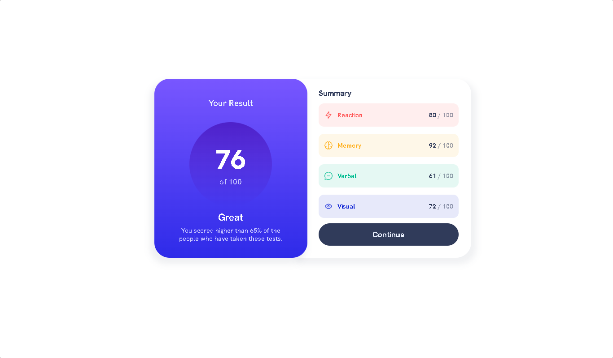
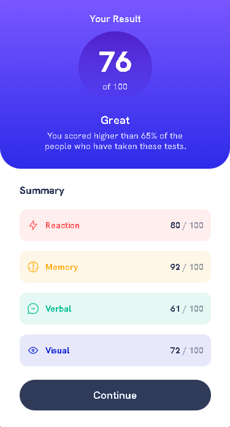

# **Frontend Mentor - Results summary component solution**

This is a solution to the [Results summary component challenge on Frontend Mentor](https://www.frontendmentor.io/challenges/results-summary-component-CE_K6s0maV). Frontend Mentor challenges help you improve your coding skills by building realistic projects. 

## **Table of contents**

- [Overview](#overview)
  - [The challenge](#the-challenge)
  - [Screenshot](#screenshot)
  - [Links](#links)
- [My process](#my-process)
  - [Built with](#built-with)
  - [What I learned](#what-i-learned)
  - [Continued development](#continued-development)
  - [Useful resources](#useful-resources)
- [Author](#author)
- [Acknowledgments](#acknowledgments)


## Overview

### The challenge:

- Users should be able to:

  - View the optimal layout for the interface depending on their device's screen size
  - See hover and focus states for all interactive elements on the page

### Screenshot - Desktop:


### Screenshot - Mobile:
 


### Links

- Solution URL: [Solution on FrontendMenotr](https://www.frontendmentor.io/solutions/responsive-results-summary-component-with-html-and-css-dquE8NPhR2)
- Live Site: [Live Site on Netlify](https://your-live-site-url.com)

## My process

- ### **Built with**
  - Semantic HTML5 markup
  - CSS custom properties
  - CSS Flexbox for layout
  - Mobile-first approach for Responsive Design

- ### **What I learned**


  - Using Linear Gradients on backgrounds.
  - Using pseudo-classes on elements

```css
.upper-box{
  background: linear-gradient(hsl(252, 100%, 67%), hsl(241, 81%, 54%));
  width: 100%;
  border: 0px solid black;
  border-radius: 0px 0px 34px 34px;
}
```

```css
.upper-box>div>span{
  font-size: 1.2rem;
  font-weight: 600;
  color: hsl(241, 100%, 89%);
}
.upper-box>div>span:first-of-type{
  font-size: 4rem;
  font-weight: 800;
  color: white;
}
```

### Useful resources

- [W3Schools](https://www.w3schools.com/css/css3_gradients.asp) - The code documentation provided here helped me to understand the usage and syntax of linear-gradient in background.
- [Notion](https://www.notion.so) - It is a project-management and note-taking web app. It helped me track the tasks I needed to perform in order to complete the challenge.


## Author

- LinkedIn - [Soban Shafiq](https://www.linkedin.com/in/soban-shafiq-6085531a4/)
- Frontend Mentor - [@the-soban](https://www.frontendmentor.io/profile/the-soban)
- Twitter - [@the_soban3](https://www.twitter.com/@the_soban3)
- Showwcase - [@the-soban](https://www.showwcase.com/the-soban)


